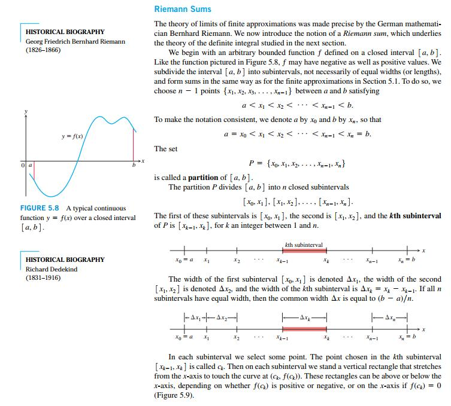
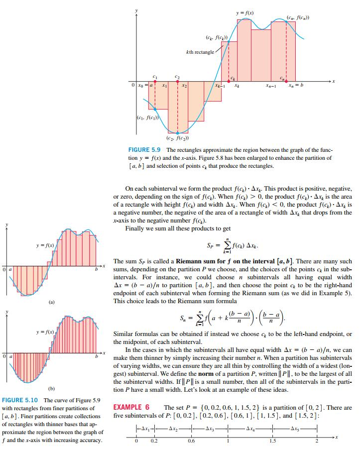

# 黎曼积分（Riemann Sums）

# 1. 基本定义
黎曼积分法是由德国数学家伯恩哈德·黎曼提出的。它定义了函数在一个区间上的积分。简单来说，黎曼积分是通过将积分区间分割成无数小区间，然后计算每个小区间的“面积”（实际上是函数值与小区间长度的乘积），最后将这些面积加总起来得到的。

# 2. 数学表达式
如果我们有一个定义在闭区间$[a, b]$上的函数${f(x)}$ ，那么该函数在这个区间上的黎曼积分可以表示为:

\[ \int_a^b {f(x)} d x \]

这个表达式代表的是，当我们将区间$[a, b]$划分得越来越细时，所有小区间上的${f(x)}$与小区间长度乘积的和，趋近于的一个值。

# 3. 适用函数
理论上，任何定义在闭区间上的函数都可以尝试用黎曼积分法来积分，但并非所有函数都是黎曼可积的。一个函数是黎曼可积的基本条件是它在积分区间上必须是有界的，且只有有限个或可数个不连续点。

# 4. 使用时需要注意的点
- 函数的界限：确保函数在积分区间内是有界的。
- 区间的细分：在实际应用中，区间的细分越多，积分的结果越精确。
- 不连续点的处理：函数在不连续点可能不是黎曼可积的，这需要特别注意。

# 5. 如何证明某个函数黎曼可积
要证明一个函数是黎曼可积的，通常的方法是使用“达布和（Darboux sums）"的概念。具体来说，需要证明对于任意给定的正数$\varepsilon$，存在一个划分，使得该函数的上达布和与下达布和之差小于$\varepsilon$。这表明，随着划分的细化，函数在该区间上的积分趋于一个固定的值。

[Riemann-Sums-wiki-en](assets/Riemann-Sums-wiki-en.htm)

[Riemann-Sums-wiki-zh](assets/Riemann-Sums-wiki-zh.htm)